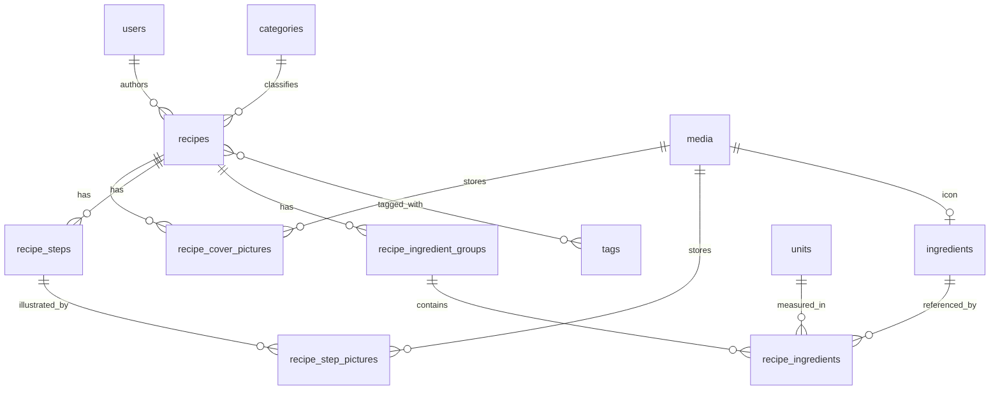

# Recipes — domain model and API design

Status: **design only**, nothing implemented yet. This document is the specification the implementation session works
from. Companion documents: [media-storage.md](media-storage.md) (images),
[api-error-handling.md](api-error-handling.md) (status codes and exception mapping),
[optional-authentication.md](optional-authentication.md) (how public reads coexist with JWT auth).

## What the feature is

A recipe library for personal / friends-and-family use. Anyone can browse and read recipes without an account;
creating and editing requires a login. Ingredients, categories, tags and units are **shared reference data** stored
once in their own tables, so a recipe references them rather than repeating their text — that is what makes
"all recipes using eggs" or "everything tagged vegetarian" a query instead of a string search.

## Entities



### Reference tables (shared, unique values)

| Table         | Columns                                                                                         | Who can create         |
|---------------|-------------------------------------------------------------------------------------------------|------------------------|
| `ingredients` | `id`, `name`, `normalized_name` (unique), `icon_media_id` (null), `created_at`, `created_by_id`  | any authenticated user |
| `categories`  | `id`, `name`, `normalized_name` (unique)                                                        | `ADMIN` only           |
| `tags`        | `id`, `name`, `normalized_name` (unique)                                                        | `ADMIN` only           |
| `units`       | `id`, `name`, `normalized_name` (unique), `abbreviation`                                        | `ADMIN` only           |

`units` is admin-only by analogy with categories and tags: like them it is a small closed set that shapes how every
recipe reads, and unlike ingredients it is not something a user legitimately needs to extend mid-recipe. **Confirm
this if you disagree** — it is the one permission in this table you did not specify.

#### Why a `normalized_name` column instead of a plain `unique` on `name`

"Unique values" has to mean unique *to a human*, not unique as a byte sequence. Without normalization the ingredients
table happily accepts `Oeuf`, `oeuf`, `Œuf`, ` oeuf `, and `OEUF` as five distinct rows, and the property that
justified having a table at all — one canonical row per real-world ingredient — is dead within a week.

So each reference row stores two values: `name` as the user typed it (used for display), and `normalized_name`
carrying the `unique` constraint. Normalization = trim, collapse inner whitespace, lowercase, strip accents via
`java.text.Normalizer` NFD plus combining-mark removal. This lives in one place (a `ReferenceNameNormalizer` utility)
shared by all four services.

Deliberately **not** normalized away: plurals. `oeuf` and `oeufs` stay two rows. Stemming French correctly is a real
NLP problem, and getting it wrong silently merges unrelated ingredients; a human noticing a duplicate and an admin
merging it is the cheaper failure mode at this scale.

The unique constraint is a real database constraint, not just a service-side `existsBy` check — check-then-insert
races under concurrent requests. The service does check first, so the common case returns a clean 409 with a useful
message, but the constraint is what actually guarantees the invariant. A `DataIntegrityViolationException` escaping
the race also maps to 409, see [api-error-handling.md](api-error-handling.md).

### `recipes`

| Column            | Type                | Notes                                                  |
|-------------------|---------------------|--------------------------------------------------------|
| `id`              | UUID (String)       | `GenerationType.UUID`, matching every existing entity  |
| `title`           | varchar, not null   | not unique — see below                                 |
| `recommendations` | text, nullable      | free text shown beside the recipe, outside the steps   |
| `category_id`     | FK → `categories`   | not null                                               |
| `author_id`       | FK → `users`        | not null, **immutable after creation**                 |
| `created_at`      | timestamp, not null | set by JPA auditing                                    |
| `updated_at`      | timestamp, not null | set by JPA auditing                                    |
| `updated_by_id`   | FK → `users`, null  | set by JPA auditing; null until the first update       |

**`author_id` is both the author and the creating user.** You clarified these are the same person, so there is no
separate `created_by` column — a second FK holding the same value forever is a bug waiting to happen (the two drift,
and then nobody knows which one drives permissions). `author_id` is the owner, and it is what the ownership check
reads.

**`title` is not unique.** Two people can legitimately both post "Tarte aux pommes", and one person may keep two
variants. A uniqueness constraint here would produce a 409 the user cannot act on. Recipes are addressed by id.

**`recommendations` is a single text field, not a list.** You described it as a block displayed next to the recipe;
a list would only add ordering machinery for something the frontend renders as one paragraph. If it later needs
bullets, markdown in this field handles it without a schema change.

### Ordered child tables

Steps, ingredient groups, ingredient lines and pictures are all ordered, and each carries an explicit `position`
integer with a `UNIQUE (parent_id, position)` constraint.

| Table                      | Columns                                                                                    |
|----------------------------|--------------------------------------------------------------------------------------------|
| `recipe_steps`             | `id`, `recipe_id`, `position`, `instruction` (text, not null)                              |
| `recipe_step_pictures`     | `id`, `step_id`, `media_id`, `position`, `alt_text` (null)                                 |
| `recipe_cover_pictures`    | `id`, `recipe_id`, `media_id`, `position`, `alt_text` (null)                               |
| `recipe_ingredient_groups` | `id`, `recipe_id`, `position`, `title` (nullable)                                          |
| `recipe_ingredients`       | `id`, `group_id`, `ingredient_id`, `quantity`, `unit_id` (null), `note` (null), `position` |
| `recipe_tags`              | `recipe_id`, `tag_id` — composite PK, plain `@ManyToMany` join table                       |

`recipe_ingredient_groups.title` is nullable on purpose: most recipes have a single unnamed ingredient list, and
forcing a title there would make every such recipe carry a meaningless "Ingrédients" heading. Null means "render the
list with no heading". Recipes that do split ("Pour la pâte" / "Pour la garniture") title every group.

`position` is maintained by the service, which renumbers `0..n-1` from the order of the incoming request on every
write. JPA's `@OrderColumn` was considered and rejected: it makes Hibernate issue extra UPDATE statements on
reordering and behaves badly with nulls in the collection. An explicit column the service owns is boring and
predictable, and it is readable from plain SQL when debugging.

### `recipe_ingredients` — quantity and unit

You chose a numeric amount plus a `units` reference table:

- `quantity` — `NUMERIC(10,3)`, **nullable**. Null covers "sel, poivre" and "de l'huile", where no amount is
  meaningful. `BigDecimal` in Java, never `double` — floating-point rounding artifacts have no place in a quantity a
  human typed. Three decimals is enough for 0.5 tsp or 0.25 L without inviting nonsense precision.
- `unit_id` — FK to `units`, **nullable**. Null means a bare count ("3 œufs"). A `PIECE` unit row was considered and
  rejected: it forces every recipe to pick a unit and puts "3 pièces œufs" in front of the renderer.
- `note` — nullable varchar, for the qualifier belonging to *this line* rather than to the ingredient itself:
  "finement haché", "à température ambiante". Without it, people encode that into the ingredient name and the shared
  ingredients table fills up with rows like `oignon finement haché`.

Keeping the amount numeric is what makes serving-scaling and an aggregated shopping list possible later. Neither is in
scope now, but both become schema migrations if the quantity is a string.

## Java package layout

Follows the existing structure; the only new top-level packages are `mappers` and `exceptions`.

```
entities/     RecipeEntity, RecipeStepEntity, RecipeStepPictureEntity, RecipeCoverPictureEntity,
              RecipeIngredientGroupEntity, RecipeIngredientEntity, IngredientEntity,
              CategoryEntity, TagEntity, UnitEntity, MediaEntity, AuditableEntity (@MappedSuperclass)
repositories/ RecipesRepository, IngredientsRepository, CategoriesRepository, TagsRepository,
              UnitsRepository, MediaRepository
services/     RecipeService, IngredientService, CategoryService, TagService, UnitService,
              MediaService, MediaStorageService (interface), FilesystemMediaStorageService
controllers/  RecipeController, IngredientController, CategoryController, TagController,
              UnitController, MediaController
models/recipes/requests/   CreateRecipeRequest, UpdateRecipeRequest, RecipeStepRequest,
                           IngredientGroupRequest, RecipeIngredientRequest, PictureRequest
models/recipes/responses/  RecipeResponse, RecipeSummaryResponse, RecipeStepResponse, ...
models/reference/          CreateIngredientRequest, IngredientResponse, CategoryResponse, ...
mappers/      RecipeMapper, ReferenceMapper
exceptions/   ResourceNotFoundException, ResourceConflictException, ForbiddenOperationException,
              InvalidReferenceException
```

Per the root `CLAUDE.md`, all services live directly under `services` — `MediaStorageService` and its
`FilesystemMediaStorageService` implementation are siblings there, exactly like `MailService`/`SmtpMailService`.

`mappers` is a package rather than static factory methods on the response records. Entity-to-DTO translation for a
full recipe spans six entity types; putting it inside `RecipeService` gives that service two reasons to change
(business rules *and* wire format), and putting it inside the record makes a DTO depend on the entity layer. A
`@Component RecipeMapper` keeps each piece single-purpose and is trivially unit-testable — which matters, because it
is a large block of lines counting against the coverage gate.

## Auditing

Enable Spring Data JPA auditing (`@EnableJpaAuditing`) rather than stamping timestamps by hand in every service —
five services each remembering to set `updated_at` is precisely the duplication that gets forgotten in one branch.

- An `AuditableEntity` `@MappedSuperclass` carries `createdAt` (`@CreatedDate`), `updatedAt` (`@LastModifiedDate`)
  and `updatedBy` (`@LastModifiedBy`); recipes and the reference entities extend it.
- An `AuditorAware<UserEntity>` bean reads the `userId` claim from the `JwtAuthenticationToken` in the
  `SecurityContextHolder` and returns `usersRepository.getReferenceById(userId)`. `getReferenceById` returns a lazy
  proxy, so `updated_by_id` stays a genuine foreign key without costing a SELECT on every save.
- It returns `Optional.empty()` when there is no authentication — relevant for seeding and tests; public reads never
  write.

Existing entities (`UserEntity`, `RoleEntity`) are **not** retrofitted onto `AuditableEntity` in this scope. That is a
separate schema change to their tables with no bearing on recipes.

## API surface

`GET` is public everywhere; everything else needs a JWT. See
[optional-authentication.md](optional-authentication.md) for why the JWT filter has to change to make that work.

### Recipes — `/recipes`

| Method | Path            | Auth              | Success | Notes                                                               |
|--------|-----------------|-------------------|---------|---------------------------------------------------------------------|
| GET    | `/recipes`      | public            | 200     | paginated summaries; filters `categoryId`, `tagId`, `authorId`, `q` |
| GET    | `/recipes/{id}` | public            | 200     | full recipe                                                         |
| POST   | `/recipes`      | `USER`            | 201     | `Location` header; body is the created recipe                       |
| PUT    | `/recipes/{id}` | author or `ADMIN` | 200     | partial update, see below                                           |
| DELETE | `/recipes/{id}` | author or `ADMIN` | 204     | **not in your requirements — flagged below**                        |

`DELETE` was not in your list. A library with no way to remove a mistaken entry is awkward, and its permission rule is
identical to update, so it is designed here — but say the word and it comes out. If it stays, deletion cascades to
steps, groups, ingredient lines and picture links, and merely dereferences (never deletes) ingredients, tags and the
category.

### Reference data

| Method | Path                | Auth              | Success | Failure notes                                    |
|--------|---------------------|-------------------|---------|--------------------------------------------------|
| GET    | `/ingredients`      | public            | 200     | paginated, `?q=` prefix search for the edit form |
| POST   | `/ingredients`      | any authenticated | 201     | 409 if the normalized name exists                |
| PUT    | `/ingredients/{id}` | `ADMIN`           | 200     | rename / change icon                             |
| DELETE | `/ingredients/{id}` | `ADMIN`           | 204     | **409 if any recipe still references it**        |
| GET    | `/categories`       | public            | 200     |                                                  |
| POST   | `/categories`       | `ADMIN`           | 201     | 409 on duplicate                                 |
| PUT    | `/categories/{id}`  | `ADMIN`           | 200     |                                                  |
| DELETE | `/categories/{id}`  | `ADMIN`           | 204     | 409 if in use                                    |
| GET    | `/tags`             | public            | 200     |                                                  |
| POST   | `/tags`             | `ADMIN`           | 201     | 409 on duplicate                                 |
| PUT    | `/tags/{id}`        | `ADMIN`           | 200     |                                                  |
| DELETE | `/tags/{id}`        | `ADMIN`           | 204     | 409 if in use                                    |
| GET    | `/units`            | public            | 200     |                                                  |
| POST   | `/units`            | `ADMIN`           | 201     | 409 on duplicate                                 |
| PUT    | `/units/{id}`       | `ADMIN`           | 200     |                                                  |
| DELETE | `/units/{id}`       | `ADMIN`           | 204     | 409 if in use                                    |

Note the asymmetry on ingredients: **creation** is open to any authenticated user (your requirement), but **editing
and deleting** are admin-only. Renaming a shared row silently rewrites every recipe referencing it, and deleting one
would orphan them; that is a different kind of power from adding a missing row. Flagged because you specified only the
create side.

Deleting reference data that is still referenced returns **409 Conflict**, never a cascade. Silently gutting other
people's recipes because an admin tidied the tag list is not an acceptable side effect of a DELETE.

### Media — `/media`

| Method | Path          | Auth              | Success | Notes                                  |
|--------|---------------|-------------------|---------|----------------------------------------|
| POST   | `/media`      | any authenticated | 201     | multipart upload, returns the media id |
| GET    | `/media/{id}` | public            | 200     | the image bytes                        |

Fully specified in [media-storage.md](media-storage.md).

## Update semantics

`UpdateRecipeRequest` uses `Optional<T>` fields, matching the existing `UpdateUserRequest` — an absent field is left
alone.

For the **collections** (steps, ingredient groups, cover pictures, tags), a present value **replaces the whole
collection**. `Optional<List<RecipeStepRequest>> steps` absent means steps untouched; present means these are now the
steps, in this order.

The alternative — per-element patching with client-supplied child ids and add/update/remove intent — is a much more
complex contract that buys nothing here: the editing UI is a form holding the entire recipe, so it always knows the
full list. Replacement also makes reordering free, where patching needs explicit position juggling.

Implementation note: replacement means `orphanRemoval = true` on those `@OneToMany` collections, and mutating the
existing collection in place (`clear()` then `addAll()`) rather than assigning a new one — reassigning a
Hibernate-managed collection throws.

## Reading recipes without N+1 queries

A full recipe touches category, author, tags, groups → lines → ingredient + unit, steps → pictures, and cover
pictures. Loading that lazily is a textbook N+1.

- **Detail** (`GET /recipes/{id}`): do not stack `JOIN FETCH` across several collections — Hibernate either throws
  `MultipleBagFetchException` or returns a cartesian product. Instead map the collections as `Set` and set
  `spring.jpa.properties.hibernate.default_batch_fetch_size=50`, so Hibernate loads each collection level in one
  batched IN-query. Predictable, and it needs no per-query tuning.
- **List** (`GET /recipes`): never load the full graph. `RecipeSummaryResponse` carries only id, title, first cover
  picture id, category, tags and author name, populated by a dedicated projection query. A recipe list page must not
  cost one full recipe load per row.
- Pagination is `Pageable` with a **server-side cap** on page size (e.g. 100). Uncapped, `?size=100000` is a free
  denial of service on a VPS.

Indexes: `recipes(category_id)`, `recipes(author_id)`, `recipes(created_at DESC)` for the default listing order, and
`recipe_tags(tag_id)` for tag filtering.

## Reference data has to be seeded

`POST /recipes` cannot succeed until a category exists, and no category can be created until an `ADMIN` user exists.
This is the same trap that exists today — `CLAUDE.md` notes a `USER` row must be inserted into `roles` by hand before
`POST /users/create` works — except recipes make it four tables deep.

Proposal for this scope: an idempotent `ReferenceDataSeeder` (`ApplicationRunner`) inserting the `USER` and `ADMIN`
roles and a starter set of units (g, kg, ml, l, c. à soupe, c. à café, pincée) when absent. Categories and tags stay
empty — those are product choices, not defaults.

Separately, and **out of scope here**: `ddl-auto=update` with no migration tool is going to hurt on the VPS. It cannot
drop or rename anything, it silently skips changes it cannot make, and nothing records what a given database has had
applied. Adding Flyway deserves its own session before the first real deployment.

## Testing

The 90% line-coverage gate applies to all of this. Concretely:

- Service unit tests with mocked repositories, in the style of the existing `UserServiceTest` — including the failure
  branches, which is where the interesting status codes come from: unknown ingredient id, non-author update attempt,
  duplicate normalized name, deleting an in-use tag.
- `RecipeMapper` tested directly against a hand-built entity graph.
- A `@SpringBootTest` covering the authorization matrix end to end: anonymous GET succeeds, anonymous POST is 401, a
  non-author PUT is 403, an admin PUT succeeds. As the existing `SecurityErrorHandlingTest` shows, a
  `standaloneSetup` MockMvc cannot catch this class of bug because it has no security filter chain.
- `.http` files in `src/test/requests`, one per endpoint/flow, each walking the full scenario including failures:
  `recipes.http`, `ingredients.http`, `categories.http`, `tags.http`, `units.http`, `media.http`.

## Open points to confirm

1. `DELETE /recipes/{id}` — not in your requirements; designed above unless you cut it.
2. Ingredient **edit/delete** restricted to `ADMIN` while **create** is open to every authenticated user.
3. `units` administered by `ADMIN`, like categories and tags.
4. No `servings` / prep-time / cook-time fields — you did not list them, so they are out. All three are additive
   later, but `servings` in particular is what makes the numeric quantities scalable, so it is worth deciding now
   rather than after recipes exist.
