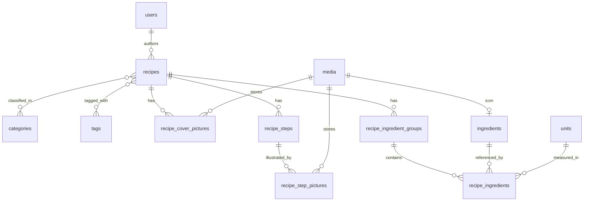

# Recipes — domain model and API design

Status: **implemented**. This document is the specification the implementation session worked
from, updated in place where the implementation proved a decision wrong. Companion documents: [media-storage.md](media-storage.md) (images),
[api-error-handling.md](api-error-handling.md) (status codes and exception mapping),
[optional-authentication.md](optional-authentication.md) (how public reads coexist with JWT auth).

## What the feature is

A recipe library for personal / friends-and-family use. Anyone can browse and read recipes without an account;
creating and editing requires a login. Ingredients, categories, tags and units are **shared reference data** stored
once in their own tables, so a recipe references them rather than repeating their text — that is what makes
"all recipes using eggs" or "everything tagged vegetarian" a query instead of a string search.

## Entities



### Reference tables (shared, unique values)

| Table         | Columns                                                                                         | Who can create         |
|---------------|-------------------------------------------------------------------------------------------------|------------------------|
| `ingredients` | `id`, `name`, `normalized_name` (unique), `icon_media_id` (null), `created_at`, `created_by_id` | any authenticated user |
| `categories`  | `id`, `name`, `normalized_name` (unique)                                                        | `ADMIN` only           |
| `tags`        | `id`, `name`, `normalized_name` (unique)                                                        | `ADMIN` only           |
| `units`       | `id`, `name`, `normalized_name` (unique), `abbreviation`                                        | `ADMIN` only           |

`units` is admin-only by analogy with categories and tags: like them it is a small closed set that shapes how every
recipe reads, and unlike ingredients it is not something a user legitimately needs to extend mid-recipe. **Confirm
this if you disagree** — it is the one permission in this table you did not specify.

#### Why a `normalized_name` column instead of a plain `unique` on `name`

"Unique values" has to mean unique *to a human*, not unique as a byte sequence. Without normalization the ingredients
table happily accepts `Oeuf`, `oeuf`, `Œuf`, ` oeuf `, and `OEUF` as five distinct rows, and the property that
justified having a table at all — one canonical row per real-world ingredient — is dead within a week.

So each reference row stores two values: `name` as the user typed it (used for display), and `normalized_name`
carrying the `unique` constraint. Normalization = trim, collapse inner whitespace, lowercase, strip accents via
`java.text.Normalizer` NFD plus combining-mark removal. This lives in one place (a `ReferenceNameNormalizer` utility)
shared by all four services.

Deliberately **not** normalized away: plurals. `oeuf` and `oeufs` stay two rows. Stemming French correctly is a real
NLP problem, and getting it wrong silently merges unrelated ingredients; a human noticing a duplicate and an admin
merging it is the cheaper failure mode at this scale.

The unique constraint is a real database constraint, not just a service-side `existsBy` check — check-then-insert
races under concurrent requests. The service does check first, so the common case returns a clean 409 with a useful
message, but the constraint is what actually guarantees the invariant. A `DataIntegrityViolationException` escaping
the race also maps to 409, see [api-error-handling.md](api-error-handling.md).

### `recipes`

| Column            | Type                | Notes                                                 |
|-------------------|---------------------|-------------------------------------------------------|
| `id`              | UUID (String)       | `GenerationType.UUID`, matching every existing entity |
| `title`           | varchar, not null   | not unique — see below                                |
| `recommendations` | text, nullable      | free text shown beside the recipe, outside the steps  |
| `author_id`       | FK → `users`        | not null, **immutable after creation**                |
| `created_at`      | timestamp, not null | set by JPA auditing                                   |
| `updated_at`      | timestamp, not null | set by JPA auditing                                   |
| `updated_by_id`   | FK → `users`, null  | set by JPA auditing; null until the first update      |

Categories are **not** a column here — see the next section.

**`author_id` is both the author and the creating user.** You clarified these are the same person, so there is no
separate `created_by` column — a second FK holding the same value forever is a bug waiting to happen (the two drift,
and then nobody knows which one drives permissions). `author_id` is the owner, and it is what the ownership check
reads.

**`title` is not unique.** Two people can legitimately both post "Tarte aux pommes", and one person may keep two
variants. A uniqueness constraint here would produce a 409 the user cannot act on. Recipes are addressed by id.

**`recommendations` is a single text field, not a list.** You described it as a block displayed next to the recipe;
a list would only add ordering machinery for something the frontend renders as one paragraph. If it later needs
bullets, markdown in this field handles it without a schema change.

### Categories are many-to-many

A recipe belongs to **one or more** categories, through a `recipe_categories` join table with a composite primary key
`(recipe_id, category_id)` — structurally identical to `recipe_tags`, and mapped the same way, as a plain
`@ManyToMany`.

| Table               | Columns                                   |
|---------------------|-------------------------------------------|
| `recipe_categories` | `recipe_id`, `category_id` — composite PK |
| `recipe_tags`       | `recipe_id`, `tag_id` — composite PK      |

**At least one category is required.** `CreateRecipeRequest.categoryIds` is `@NotEmpty`; the "one or more" is enforced
at the API layer, not by the schema, since a join table cannot express a minimum cardinality. This keeps the original
intent (every recipe is classified and therefore browsable) while allowing the tarte that is honestly both a dessert and
a goûter.

No ordering column: unlike steps or ingredient lines, there is no meaningful "first" category. The API returns them
sorted by name so the output is at least stable.

#### Categories and tags are now structurally identical — is that a problem?

Worth naming, since after this change both are admin-curated many-to-many reference tables with a unique normalized
name. The only differences left are semantic:

- **Categories** are a taxonomy: a small, stable, mostly-disjoint set (entrées, plats, desserts) that drives the main
  navigation, and every recipe must have at least one.
- **Tags** are open-ended facets (végétarien, sans gluten, rapide, Noël) that can proliferate, and are optional.

That distinction is real and it is a product decision, but it is enforced by convention and by the `@NotEmpty` on
categories — nothing in the schema stops the two from converging into "two lists of labels" over time. Both are kept
because you asked for both tables. **If in six months the category list has grown to twenty entries and recipes carry
five each, that is the signal they have merged in practice and one of them should go.** Recorded here so that is a
recognisable outcome rather than a surprise.

### Ordered child tables

Steps, ingredient groups, ingredient lines and pictures are all ordered, and each carries an explicit `position`
integer with a `UNIQUE (parent_id, position)` constraint.

| Table                      | Columns                                                                                    |
|----------------------------|--------------------------------------------------------------------------------------------|
| `recipe_steps`             | `id`, `recipe_id`, `position`, `instruction` (text, not null)                              |
| `recipe_step_pictures`     | `id`, `step_id`, `media_id`, `position`, `alt_text` (null)                                 |
| `recipe_cover_pictures`    | `id`, `recipe_id`, `media_id`, `position`, `alt_text` (null)                               |
| `recipe_ingredient_groups` | `id`, `recipe_id`, `position`, `title` (nullable)                                          |
| `recipe_ingredients`       | `id`, `group_id`, `ingredient_id`, `quantity`, `unit_id` (null), `note` (null), `position` |

`recipe_ingredient_groups.title` is nullable on purpose: most recipes have a single unnamed ingredient list, and
forcing a title there would make every such recipe carry a meaningless "Ingrédients" heading. Null means "render the
list with no heading". Recipes that do split ("Pour la pâte" / "Pour la garniture") title every group.

`position` is maintained by the service, which renumbers `0..n-1` from the order of the incoming request on every
write. JPA's `@OrderColumn` was considered and rejected: it makes Hibernate issue extra UPDATE statements on
reordering and behaves badly with nulls in the collection. An explicit column the service owns is boring and
predictable, and it is readable from plain SQL when debugging.

#### Writing `position` is only half the job — every such collection needs `@OrderBy("position")`

Rejecting `@OrderColumn` means **nothing re-applies the order on the read path unless it is asked for explicitly**, and
the collections are mapped as `Set` (see [Reading recipes without N+1 queries](#reading-recipes-without-n1-queries)), so
Hibernate hydrates them into a `PersistentSet` backed by a `HashSet` — iteration order is hash order, not insertion
order and certainly not `position` order. A five-step recipe stored correctly as 0..4 comes back out of
`GET /recipes/{id}` with "Enfourner 40 min" second and "Préchauffer le four" last, and no test that only round-trips a
single-step recipe will ever notice.

So every one of these associations carries `@OrderBy("position")`:

```java

@OneToMany(mappedBy = "recipe", cascade = ALL, orphanRemoval = true)
@OrderBy("position")
private Set<RecipeStepEntity> steps = new LinkedHashSet<>();
```

That applies to `steps`, `ingredientGroups`, `coverPictures`, each group's `ingredients`, and each step's `pictures`.
`@OrderBy` adds an `ORDER BY` to the SQL Hibernate already issues and hydrates into a `LinkedHashSet`, so it costs
nothing extra and survives batch fetching.

Two consequences that follow from it, both easy to miss:

- `RecipeSummaryResponse`'s "first cover picture" is only well-defined because `coverPictures` is ordered. Without
  `@OrderBy`, the thumbnail shown in the recipe list can change between two identical requests with no write in between.
- The mapper must **iterate**, never re-sort and never re-derive: `position` is a storage detail, and the API contract
  is the order of the returned array. It is not exposed as a field in the response.

This is the same class of bug as the `IN`-does-not-preserve-order note in
[Listing](#listing--get-recipes) below — ordering that exists in the database is not ordering that reaches the client.
`@ManyToMany` categories and tags are exempt: they have no `position` and the API sorts them by name instead.

### `recipe_ingredients` — quantity and unit

You chose a numeric amount plus a `units` reference table:

- `quantity` — `NUMERIC(10,3)`, **nullable**. Null covers "sel, poivre" and "de l'huile", where no amount is
  meaningful. `BigDecimal` in Java, never `double` — floating-point rounding artifacts have no place in a quantity a
  human typed. Three decimals is enough for 0.5 tsp or 0.25 L without inviting nonsense precision.
- `unit_id` — FK to `units`, **nullable**. Null means a bare count ("3 œufs"). A `PIECE` unit row was considered and
  rejected: it forces every recipe to pick a unit and puts "3 pièces œufs" in front of the renderer.
- `note` — nullable varchar, for the qualifier belonging to *this line* rather than to the ingredient itself:
  "finement haché", "à température ambiante". Without it, people encode that into the ingredient name and the shared
  ingredients table fills up with rows like `oignon finement haché`.

Keeping the amount numeric is what makes serving-scaling and an aggregated shopping list possible later. Neither is in
scope now, but both become schema migrations if the quantity is a string.

## Package layout

You asked for domain grouping given the file count, and it is the right call: this feature adds roughly 40 classes, and
a flat `entities` package holding 16 of them stops being navigable. The layout below uses **the same four domain names
at every layer** — `recipes`, `reference`, `media`, `users` — so the tree can be read either way round: "all the recipe
classes" or "all the repositories".

```
ilenreste.unpeu.recettesback
├── configuration/           unchanged, flat (cross-cutting, not domain-owned)
├── filters/                 unchanged, flat
├── exceptions/              ResourceNotFoundException, InvalidReferenceException,
│                            ResourceConflictException, ForbiddenOperationException
├── entities/
│   ├── AuditableEntity      @MappedSuperclass, shared — stays at the root
│   ├── recipes/             RecipeEntity, RecipeStepEntity, RecipeStepPictureEntity,
│   │                        RecipeCoverPictureEntity, RecipeIngredientGroupEntity,
│   │                        RecipeIngredientEntity
│   ├── reference/           IngredientEntity, CategoryEntity, TagEntity, UnitEntity
│   ├── media/               MediaEntity
│   └── users/               UserEntity, RoleEntity, UserRolesEntity,
│                            PasswordResetTokenEntity            ← existing, moved
├── repositories/
│   ├── recipes/             RecipesRepository
│   ├── reference/           IngredientsRepository, CategoriesRepository,
│   │                        TagsRepository, UnitsRepository
│   ├── media/               MediaRepository
│   └── users/               UsersRepository, RolesRepository, UserRolesRepository,
│                            PasswordResetTokenRepository        ← existing, moved
├── services/                see the note below — this one conflicts with CLAUDE.md
├── controllers/
│   ├── recipes/             RecipeController
│   ├── reference/           IngredientController, CategoryController,
│   │                        TagController, UnitController
│   ├── media/               MediaController
│   └── users/               UserController, AuthenticationController   ← existing, moved
├── mappers/
│   ├── recipes/             RecipeMapper
│   ├── reference/           ReferenceMapper
│   └── media/               MediaMapper
└── models/
    ├── auth/                existing, already domain-grouped
    ├── users/               existing, already domain-grouped
    ├── recipes/             requests/, responses/
    ├── reference/           requests/, responses/
    └── media/               responses/
```

`models` already works this way (`models/auth`, `models/users`), so this generalises a convention the codebase has
rather than inventing one.

`configuration`, `filters` and `exceptions` stay flat. They are cross-cutting: `SecurityFilterConfig` is not a recipes
class or a users class, and `ResourceNotFoundException` is thrown by every domain. Subdividing them would produce
single-class packages that answer no question.

`AuditableEntity` stays at the `entities` root for the same reason — it is the shared supertype, owned by no domain.

### The `services` conflict — resolved: grouped, and `CLAUDE.md` amended

The root `CLAUDE.md` currently says, verbatim:

> All service classes live directly under `services` — do not create feature-specific packages (e.g. `mail`,
> `notifications`) for them, even for a single interface + implementation pair.

That rule and this request point in opposite directions, and I am not going to quietly override a standing instruction
you wrote. The stakes: recipes add eight services (`RecipeService`, `IngredientService`,
`CategoryService`, `TagService`, `UnitService`, `MediaService`, `MediaStorageService`,
`FilesystemMediaStorageService`) to the six that exist, giving **14 flat files** in one package.

My recommendation is to group them like every other layer and amend `CLAUDE.md`:

```
services/
├── recipes/    RecipeService
├── reference/  IngredientService, CategoryService, TagService, UnitService
├── media/      MediaService, MediaStorageService, FilesystemMediaStorageService
└── users/      UserService, DatabaseUserDetailsService, PasswordResetService,
                PasswordResetTokenService, MailService, SmtpMailService
```

The rule was written when six flat files were perfectly readable and the risk was inventing a `mail` package for two
classes. At 14 files across four unrelated domains that trade-off has inverted — and note the proposed packages are the
*same four domain names* used everywhere else, not per-feature packages invented ad hoc, which is what the rule was
actually guarding against.

**Decided: group by domain.** `CLAUDE.md`'s Architecture section was rewritten in the same commit as the package move
— a design doc must not be the only place a convention is recorded — and now states the domain-sub-package rule
directly, with the superseded flat-`services` rule kept as an explicit note so the change is not mistaken for drift.

### Moving the existing classes

The `← existing, moved` entries above are a pure package rename of code that already works: no logic changes, only
imports. Worth doing so the tree does not end up half-grouped, but it should be its **own commit**, separate from the
recipes work, so that a `git log` for the feature is not drowned in import churn. It is also the kind of change an IDE
refactor does correctly in one action.

## Repositories

Every query the implementation needs, with the reasoning where the obvious version is wrong. All interfaces extend
`JpaRepository<T, String>`, so `findById`, `findAllById`, `save`, `saveAll`, `delete` and `existsById` come for free and
are not repeated below.

### `RecipesRepository`

#### Listing — `GET /recipes`

The naive version, `Page<RecipeEntity> findByCategories_Id(String id, Pageable p)`, is broken in two ways at once: a
join onto a to-many collection produces **duplicate rows** (one per matching category), and Spring Data's derived
`COUNT` query then counts those duplicates, so `page.getTotalElements()` lies and the last page is wrong.

Filter with `EXISTS` subqueries instead of joins, and page over **ids only**:

```java

@Query("""
        SELECT r.id FROM RecipeEntity r
        WHERE (:authorId   IS NULL OR r.author.id = :authorId)
          AND (:categoryId IS NULL OR EXISTS (SELECT 1 FROM r.categories c WHERE c.id = :categoryId))
          AND (:tagId      IS NULL OR EXISTS (SELECT 1 FROM r.tags       t WHERE t.id = :tagId))
          AND (:q          IS NULL OR LOWER(r.title) LIKE LOWER(CONCAT('%', :q, '%')))
        """)
Page<String> searchIds(@Param("authorId") String authorId,
                       @Param("categoryId") String categoryId,
                       @Param("tagId") String tagId,
                       @Param("q") String q,
                       Pageable pageable);

@Query("SELECT r FROM RecipeEntity r JOIN FETCH r.author WHERE r.id IN :ids")
List<RecipeEntity> findAllForSummary(@Param("ids") Collection<String> ids);
```

`EXISTS` keeps one row per recipe, so both the page and its count are correct. The second query then loads exactly that
page's recipes; their `categories`, `tags` and `coverPictures` collections are filled by Hibernate's batch fetching
(below) in a bounded number of extra queries, not one per row.

**`IN` does not preserve order.** `findAllForSummary` returns rows in whatever order PostgreSQL likes, so the service
must reorder them to match `searchIds`' page content before mapping — otherwise the sort the user asked for silently
disappears. This is the single easiest thing to get wrong in this whole design.

The `:param IS NULL OR ...` form is used instead of a JPA `Specification` because four optional filters is exactly the
size where the Criteria API costs more in ceremony than it returns. If filters keep being added, revisit.

`LIKE '%q%'` cannot use a B-tree index, so title search is a sequential scan. Fine for hundreds of recipes; if it ever
is not, the fix is a `pg_trgm` GIN index or PostgreSQL full-text search, not a different query shape.

**`:q` needs an explicit `CAST`.** As first written, this query failed on every request that did not filter by title —
which is the most common request the endpoint will ever serve:

```
ERROR: function lower(bytea) does not exist
```

A bare null parameter gives PostgreSQL nothing to infer a type from inside `CONCAT`, so it plans the argument as
`bytea`. `CAST(:q AS string)`, in both the null check and the comparison, fixes it. The other three parameters are
compared with `=` against a text column and take their type from that.

This is the clearest argument for the `@DataJpaTest` requirement below: the bug is invisible to a mocked repository,
and it breaks the endpoint's default behaviour completely.

#### Detail — `GET /recipes/{id}`

Plain inherited `findById`, plus `spring.jpa.properties.hibernate.default_batch_fetch_size=50` in
`application.properties`. That setting makes Hibernate load each lazy collection level with a single batched
`IN`-query instead of one query per parent, which flattens the N+1 across the whole graph without a single
`@EntityGraph`.

Deliberately not written: a `findDetailById` stacking several `LEFT JOIN FETCH`. More than one collection fetch in one
query throws `MultipleBagFetchException` or returns a cartesian product. Add a targeted `@EntityGraph` later only if the
SQL log shows an actual problem — batch fetching is the version that does not need tuning per query.

#### Ownership check

```java

@Query("SELECT r.author.id FROM RecipeEntity r WHERE r.id = :id")
Optional<String> findAuthorIdById(@Param("id") String id);
```

`PUT` needs the whole entity anyway, but `DELETE` does not — this checks permission and existence in one scalar query
without materialising a recipe that is about to be thrown away. An empty `Optional` is the 404; a mismatch is the 403.

#### Reference-usage checks (the 409-on-delete rule)

All four live here rather than on the reference repositories, because they all ask the same question — "does any recipe
still point at this?" — and keeping them together is what stops a fifth variant being invented later.

```java

@Query("SELECT COUNT(r) > 0 FROM RecipeEntity r JOIN r.categories c WHERE c.id = :categoryId")
boolean isCategoryUsed(@Param("categoryId") String categoryId);

@Query("SELECT COUNT(r) > 0 FROM RecipeEntity r JOIN r.tags t WHERE t.id = :tagId")
boolean isTagUsed(@Param("tagId") String tagId);

@Query("""
        SELECT COUNT(ri) > 0 FROM RecipeEntity r
        JOIN r.ingredientGroups g JOIN g.ingredients ri
        WHERE ri.ingredient.id = :ingredientId
        """)
boolean isIngredientUsed(@Param("ingredientId") String ingredientId);

@Query("""
        SELECT COUNT(ri) > 0 FROM RecipeEntity r
        JOIN r.ingredientGroups g JOIN g.ingredients ri
        WHERE ri.unit.id = :unitId
        """)
boolean isUnitUsed(@Param("unitId") String unitId);
```

Duplicate rows are harmless here — the question is only whether the count exceeds zero.

### Reference repositories

`IngredientsRepository`, `CategoriesRepository`, `TagsRepository` and `UnitsRepository` are the same three methods over
their own entity:

```java
Optional<IngredientEntity> findByNormalizedName(String normalizedName);

boolean existsByNormalizedName(String normalizedName);

Page<IngredientEntity> findByNormalizedNameStartingWithOrderByName(String prefix, Pageable pageable);
```

- `existsByNormalizedName` — the pre-check that produces a clean 409 on create.
- `findByNormalizedName` — lets create return *which* existing row collided, so the client can select it instead of
  retrying blindly.
- `findByNormalizedNameStartingWith` — autocomplete in the recipe editor. **`StartingWith`, not `Containing`**: a
  trailing wildcard uses the index on `normalized_name`, a leading one cannot. Searching against the normalized column
  is also what makes typing `oeuf` find `Œuf`.

Only `IngredientsRepository` needs the paged search (its table is the one that grows); on categories, tags and units a
plain `findAll(Sort)` is enough and the endpoint returns everything.

### Validating body references in one query, not N

`POST /recipes` carries many ids: category ids, tag ids, one ingredient id per line, a unit id per line, media ids. A
`findById().orElseThrow()` per id is 30+ queries on a normal recipe.

The pattern, used identically at all five call sites: collect the distinct ids into a `Set`, call the inherited
`findAllById(ids)` **once**, and compare sizes. If fewer rows came back, subtract the returned ids from the requested
set and throw `InvalidReferenceException` naming the field and the missing ids — which is what makes the 400 response
actionable instead of just "bad request". The loaded entities go into a `Map<String, T>` that the rest of the write path
resolves against, so nothing is fetched twice.

Worth extracting as one small helper (`ReferenceResolver`) rather than written out five times.

### `MediaRepository`

```java

@Query("SELECT COALESCE(SUM(m.sizeBytes), 0) FROM MediaEntity m WHERE m.uploadedBy.id = :userId")
long totalBytesUploadedBy(@Param("userId") String userId);

@Query("""
        SELECT m FROM MediaEntity m
        WHERE m.createdAt < :threshold
          AND NOT EXISTS (SELECT 1 FROM RecipeCoverPictureEntity c WHERE c.media = m)
          AND NOT EXISTS (SELECT 1 FROM RecipeStepPictureEntity  s WHERE s.media = m)
          AND NOT EXISTS (SELECT 1 FROM IngredientEntity         i WHERE i.icon  = m)
        """)
List<MediaEntity> findOrphans(@Param("threshold") Instant threshold);
```

Both back gaps listed as deferred in [media-storage.md](media-storage.md) (per-user quota, orphan cleanup). They are
specified now because both are cheap to add while the entity is being written and awkward to retrofit — but neither
needs a scheduler wired up in this scope.

`COALESCE` matters: `SUM` over zero rows returns `null`, and a `long` return type then throws on unboxing the first time
a user with no uploads is checked.

### Indexes

Beyond the primary keys and the `unique` constraints on `normalized_name`:

| Index                               | Serves                               |
|-------------------------------------|--------------------------------------|
| `recipes(author_id)`                | `authorId` filter, "my recipes"      |
| `recipes(created_at DESC)`          | default listing order                |
| `recipe_categories(category_id)`    | category filter and `isCategoryUsed` |
| `recipe_tags(tag_id)`               | tag filter and `isTagUsed`           |
| `recipe_ingredients(ingredient_id)` | `isIngredientUsed`                   |
| `recipe_ingredients(unit_id)`       | `isUnitUsed`                         |
| `media(created_at)`                 | orphan sweep — the `created_at` half |
| `recipe_cover_pictures(media_id)`   | orphan sweep — first `NOT EXISTS`    |
| `recipe_step_pictures(media_id)`    | orphan sweep — second `NOT EXISTS`   |
| `ingredients(icon_media_id)`        | orphan sweep — third `NOT EXISTS`    |

The join tables get a PK index on `(recipe_id, category_id)` automatically, which covers lookups *from* a recipe; the
second index above is what covers lookups *from* a category, and a composite PK's index cannot serve that direction.

The same argument is what puts the last three rows in the table, and they are easy to leave out because the
`created_at` index looks like it already covers the orphan sweep. It does not: `findOrphans` filters on `created_at`
and then probes three separate tables through `NOT EXISTS`. **PostgreSQL does not index foreign-key columns
automatically** — only primary keys and `unique` constraints get one for free. `recipe_cover_pictures` and
`recipe_step_pictures` do have an index from their `UNIQUE (parent_id, position)` constraint, but its leading column is
`recipe_id`/`step_id`, which cannot serve a lookup by `media_id`; `ingredients.icon_media_id` has nothing at all.
Without these three, every candidate row in the sweep costs three sequential scans.

The ordered child tables need no separate `parent_id` index: their `UNIQUE (parent_id, position)` constraint already
provides one with `parent_id` leading, which is the direction those lookups actually go.

## Auditing

Enable Spring Data JPA auditing (`@EnableJpaAuditing`) rather than stamping timestamps by hand in every service —
five services each remembering to set `updated_at` is precisely the duplication that gets forgotten in one branch.

- An `AuditableEntity` `@MappedSuperclass` carries **four** fields: `createdAt` (`@CreatedDate`), `createdBy`
  (`@CreatedBy`), `updatedAt` (`@LastModifiedDate`) and `updatedBy` (`@LastModifiedBy`). Recipes and the reference
  entities extend it, and it is annotated `@EntityListeners(AuditingEntityListener.class)` — without that listener the
  annotations are inert and every column silently stays null.
- **Correction to the `recipes` table above:** `updated_by_id` is *not* null until the first update. Spring Data's
  `AuditingHandler` stamps both pairs on insert, so a freshly created row has `updated_at == created_at` and
  `updated_by_id == created_by_id`. That is the behaviour that keeps `updated_at` safely `NOT NULL`, and it is not
  worth switching off — "never updated" is readable as `updated_at == created_at`.
- **`@CreatedBy` is not optional here.** `ingredients.created_by_id` in
  the [reference tables](#reference-tables-shared-unique-values)
  above and `media.uploaded_by_id` both need it, and `ingredients` needs it precisely because ingredient creation is
  open to every authenticated user: it is the only record of who added a shared row, and it is what an admin reads
  before merging a duplicate. Omit it and, under `ddl-auto=update`, the column is never created — silently, with no
  error — and the information cannot be recovered afterwards.
- **`MediaEntity` does not extend `AuditableEntity`, but it is still audited.** Media rows are immutable by design (an
  edited picture is a new upload with a new id, never a rewrite), so `updated_at`/`updated_by_id` would be dead columns.
  It therefore declares its own two fields — `@CreatedDate Instant createdAt` and
  `@CreatedBy UserEntity uploadedBy` mapped to `uploaded_by_id` — and carries
  `@EntityListeners(AuditingEntityListener.class)` **itself**. This is easy to get wrong by omission: `media.created_at`
  is `NOT NULL` and drives the orphan sweep, so an entity that inherits nothing and forgets the listener inserts null
  and every single `POST /media` dies on the constraint.
- An `AuditorAware<UserEntity>` bean reads the `userId` claim from the `JwtAuthenticationToken` in the
  `SecurityContextHolder` and returns `usersRepository.getReferenceById(userId)`. `getReferenceById` returns a lazy
  proxy, so `updated_by_id` stays a genuine foreign key without costing a SELECT on every save.
- It returns `Optional.empty()` for anything that is not a `JwtAuthenticationToken` — see the trap below.

### The `AuditorAware` guard must be a type check, not a null check

Once [optional-authentication.md](optional-authentication.md) lands, anonymous requests no longer stop at the filter;
they continue down the chain, and Spring Security's `AnonymousAuthenticationFilter` puts an
`AnonymousAuthenticationToken` in the `SecurityContextHolder` whose principal is the **String** `"anonymousUser"`. So
"no authentication" is not the same as `authentication == null`, and a guard written the obvious way — a null check
followed by a cast to `JwtAuthenticationToken` — takes the non-empty branch on an anonymous request and throws
`ClassCastException`. `POST /users/create` is already `permitAll()` and writes, so this is reachable the moment any
audited entity is touched from an unauthenticated path.

```java

@Bean
AuditorAware<UserEntity> auditorAware(UsersRepository usersRepository) {
  return () -> Optional.ofNullable(SecurityContextHolder.getContext().getAuthentication())
          .filter(JwtAuthenticationToken.class::isInstance)     // excludes anonymous *and* null
          .map(authentication -> (String) ((JwtAuthenticationToken) authentication).getToken()
                  .getClaims().get("userId"))
          .map(usersRepository::getReferenceById);
}
```

Filtering on the concrete token type rather than on `isAuthenticated()` is deliberate: `AnonymousAuthenticationToken`
reports `isAuthenticated() == true`, so that check would not catch it either.

Empty is also the right answer for seeding and for tests running without a security context.

Existing entities (`UserEntity`, `RoleEntity`) are **not** retrofitted onto `AuditableEntity` in this scope. That is a
separate schema change to their tables with no bearing on recipes.

## API surface

`GET` is public everywhere; everything else needs a JWT. See
[optional-authentication.md](optional-authentication.md) for why the JWT filter has to change to make that work.

### Recipes — `/recipes`

| Method | Path            | Auth              | Success | Notes                                                               |
|--------|-----------------|-------------------|---------|---------------------------------------------------------------------|
| GET    | `/recipes`      | public            | 200     | paginated summaries; filters `categoryId`, `tagId`, `authorId`, `q` |
| GET    | `/recipes/{id}` | public            | 200     | full recipe                                                         |
| POST   | `/recipes`      | `USER`            | 201     | `Location` header; body is the created recipe                       |
| PUT    | `/recipes/{id}` | author or `ADMIN` | 200     | partial update, see below                                           |
| DELETE | `/recipes/{id}` | author or `ADMIN` | 204     | **not in your requirements — flagged below**                        |

`categoryId` stays a single-value filter (match recipes carrying *that* category) even though a recipe now has several.
Multi-category filtering — "desserts AND rapide" — needs an AND-vs-OR decision and a different query shape; out of scope
until there is a UI asking for it.

`DELETE` was not in your list. A library with no way to remove a mistaken entry is awkward, and its permission rule is
identical to update, so it is designed here — but say the word and it comes out. If it stays, deletion cascades to
steps, groups, ingredient lines and picture links, and merely dereferences (never deletes) ingredients, tags and
categories.

### Reference data

| Method | Path                | Auth              | Success | Failure notes                                    |
|--------|---------------------|-------------------|---------|--------------------------------------------------|
| GET    | `/ingredients`      | public            | 200     | paginated, `?q=` prefix search for the edit form |
| POST   | `/ingredients`      | any authenticated | 201     | 409 if the normalized name exists                |
| PUT    | `/ingredients/{id}` | `ADMIN`           | 200     | rename / change icon                             |
| DELETE | `/ingredients/{id}` | `ADMIN`           | 204     | **409 if any recipe still references it**        |
| GET    | `/categories`       | public            | 200     |                                                  |
| POST   | `/categories`       | `ADMIN`           | 201     | 409 on duplicate                                 |
| PUT    | `/categories/{id}`  | `ADMIN`           | 200     |                                                  |
| DELETE | `/categories/{id}`  | `ADMIN`           | 204     | 409 if in use                                    |
| GET    | `/tags`             | public            | 200     |                                                  |
| POST   | `/tags`             | `ADMIN`           | 201     | 409 on duplicate                                 |
| PUT    | `/tags/{id}`        | `ADMIN`           | 200     |                                                  |
| DELETE | `/tags/{id}`        | `ADMIN`           | 204     | 409 if in use                                    |
| GET    | `/units`            | public            | 200     |                                                  |
| POST   | `/units`            | `ADMIN`           | 201     | 409 on duplicate                                 |
| PUT    | `/units/{id}`       | `ADMIN`           | 200     |                                                  |
| DELETE | `/units/{id}`       | `ADMIN`           | 204     | 409 if in use                                    |

Note the asymmetry on ingredients: **creation** is open to any authenticated user (your requirement), but **editing
and deleting** are admin-only. Renaming a shared row silently rewrites every recipe referencing it, and deleting one
would orphan them; that is a different kind of power from adding a missing row. Flagged because you specified only the
create side.

Deleting reference data that is still referenced returns **409 Conflict**, never a cascade. Silently gutting other
people's recipes because an admin tidied the tag list is not an acceptable side effect of a DELETE.

### Media — `/media`

| Method | Path          | Auth              | Success | Notes                                  |
|--------|---------------|-------------------|---------|----------------------------------------|
| POST   | `/media`      | any authenticated | 201     | multipart upload, returns the media id |
| GET    | `/media/{id}` | public            | 200     | the image bytes                        |

Fully specified in [media-storage.md](media-storage.md).

## Update semantics

`UpdateRecipeRequest` uses `Optional<T>` fields, matching the existing `UpdateUserRequest` — an absent field is left
alone.

For the **collections** (steps, ingredient groups, cover pictures, **categories**, tags), a present value **replaces the
whole collection**. `Optional<List<RecipeStepRequest>> steps` absent means steps untouched; present means these are now
the steps, in this order. A present `categoryIds` is still validated `@NotEmpty` — an update may not strip a recipe of
its last category.

### Where the `@NotEmpty` goes — inside the `Optional`, not on it

#### What it is actually for: absent and empty are different requests

`Optional` answers *"was this field supplied?"*. `@NotEmpty` answers *"is the supplied value usable?"*. Those are
different questions, and `categoryIds` is the one field where both need answering, because the JSON can express three
states and they need three different outcomes:

| Request body           | Deserializes to          | Means                  | Outcome                   |
|------------------------|--------------------------|------------------------|---------------------------|
| field omitted          | `Optional.empty()`       | don't touch categories | 200, collection unchanged |
| `"categoryIds": []`    | `Optional.of(List.of())` | set categories to none | **400**                   |
| `"categoryIds": ["x"]` | `Optional.of([x])`       | set categories to `x`  | 200                       |

Drop the constraint and the middle row silently succeeds: `PUT` with an empty array clears the collection and leaves the
recipe uncategorised, which breaks the invariant the design leans on everywhere else — every recipe carries at least one
category, so every recipe is browsable. `CreateRecipeRequest` enforces that at creation; an update must not be a back
door around it.

The contrast with the field directly above it is the point: `tagIds` has the same `Optional<List<String>>` shape and
**no** constraint, because clearing every tag is a legitimate edit. Same type, deliberately different rule, and the
annotation is the only thing expressing the difference.

#### Why the placement matters

The constraint has to apply to the *contained list*, not to the `Optional` wrapping it — the box being absent is a legal
state we rely on, so a constraint on the box is asking the wrong question:

```java
public record UpdateRecipeRequest(
        Optional<@NotBlank String> title,
        Optional<@NotEmpty List<String>> categoryIds,          // constraint on the *contained* list
        Optional<List<String>> tagIds,
        Optional<@Valid List<RecipeStepRequest>> steps,
        ...
) {
}
```

The constraint is a **type-use annotation on the type argument** — the Bean Validation 2.0 container-element form, and
exactly how the existing `UpdateUserRequest` already writes it (`Optional<@Size(min = 3, max = 50) String> username`).

> ### Correction: this recommendation was wrong, and the suggested test is what proved it
>
> The three-line test suggested below was written first, and it failed — **for the recommended form**.
>
> Hibernate Validator's `OptionalValueExtractor` is `@UnwrapByDefault` and extracts `Optional.orElse(null)`. So an
> **absent** field arrives at the constraint as `null`, and `@NotEmpty` rejects `null`. Every partial update that did
> not mention categories would answer **400** — precisely the outcome the `Optional` was chosen to prevent.
> `@NotBlank` on `title` broke identically. This is the "quiet" failure mode the section below feared, except it
> afflicts the form the section recommended.
>
> `UpdateUserRequest` is **not** a precedent: `@Size` is null-tolerant by specification, so it passes the absent case
> by accident rather than by design. That is why the existing code has never shown the problem.
>
> The fix is a small custom constraint, `@NotEmptyIfPresent`, that says what is actually meant — absent is fine,
> supplied-but-empty is not — applied to the `Optional` itself:
>
> ```java
> public record UpdateRecipeRequest(
>         @NotEmptyIfPresent Optional<@Size(max = 200) String> title,
>         @NotEmptyIfPresent Optional<List<String>> categoryIds,
>         Optional<List<String>> tagIds,
>         Optional<List<@Valid RecipeStepRequest>> steps,
>         ...
> ) {}
> ```
>
> Null-tolerant constraints such as `@Size` still belong inside the diamond and are used there. Cascading with
> `@Valid` also works inside the diamond, through both containers, and is asserted.
>
> The lesson generalises past this field: **inside an `Optional`, a constraint that implies non-null fires on the
> absent case.** `@Size`, `@Pattern`, `@Min` and friends are safe there; `@NotNull`, `@NotBlank` and `@NotEmpty` are
> not.

Writing it in front of the field instead — `@NotEmpty Optional<List<String>> categoryIds` — looks equivalent and is not.
`@NotEmpty` lists `TYPE_USE` among its targets, so the compiler binds it to the `Optional` type rather than to the
`List` inside, and the constraint ends up aimed at the wrapper. Whether that then fails loudly
(`UnexpectedTypeException`: no validator for `Optional`) or quietly (the value extractor unwraps an absent `Optional`
to `null`, which `@NotEmpty` rejects, turning every untouched-categories update into a `400`) depends on a Hibernate
Validator internal — whether `OptionalValueExtractor` is declared `@UnwrapByDefault` — that is **not worth relying on
either way**. Both outcomes are wrong and neither is what the table above asks for.

> Resolved: it fails **quietly**, and so does the form recommended above — see the correction box. The test suggested
> here is `UpdateRecipeRequestValidationTest`, and writing it before the code is what caught this.

On the create side there is no `Optional` and no ambiguity — `CreateRecipeRequest.categoryIds` is a plain
`@NotEmpty List<String>`.

The alternative — per-element patching with client-supplied child ids and add/update/remove intent — is a much more
complex contract that buys nothing here: the editing UI is a form holding the entire recipe, so it always knows the
full list. Replacement also makes reordering free, where patching needs explicit position juggling.

Implementation note: replacement means `orphanRemoval = true` on the owned `@OneToMany` collections (steps, groups,
pictures), and mutating the existing collection in place (`clear()` then `addAll()`) rather than assigning a new one —
reassigning a Hibernate-managed collection throws. The `@ManyToMany` collections (categories, tags) take the same
in-place treatment but **without** `orphanRemoval`: removing a category from a recipe must delete the join row, never
the category.

## Reading recipes without N+1 queries

Covered per-query in [Repositories](#repositories) above; the settings that make it work:

- `spring.jpa.properties.hibernate.default_batch_fetch_size=50` — batches every lazy collection load.
- Collections mapped as `Set`, not `List`, so a stray fetch join cannot produce a bag. **A `Set` is unordered, so every
  ordered collection also needs `@OrderBy("position")`** — see
  [Writing
  `position` is only half the job](#writing-position-is-only-half-the-job--every-such-collection-needs-orderbyposition).
  Choosing `Set` for the bag problem and forgetting `@OrderBy` is how recipe steps end up shuffled in the response.
- `RecipeSummaryResponse` carries only id, title, first cover picture id, categories, tags and author name. A recipe
  list page must not cost one full recipe load per row. "First cover picture" means first by `position`, which is only
  well-defined because of the `@OrderBy` above.
- Pagination is `Pageable` with a **server-side cap** on page size (e.g. 100). Uncapped, `?size=100000` is a free
  denial of service on a VPS.

## Reference data has to be seeded

`POST /recipes` cannot succeed until a category exists, and no category can be created until an `ADMIN` user exists.
This is the same trap that exists today — `CLAUDE.md` notes a `USER` row must be inserted into `roles` by hand before
`POST /users/create` works — except recipes make it four tables deep.

Proposal for this scope: an idempotent `ReferenceDataSeeder` (`ApplicationRunner`) inserting the `USER` and `ADMIN`
roles and a starter set of units (g, kg, ml, l, c. à soupe, c. à café, pincée) when absent. Categories and tags stay
empty — those are product choices, not defaults.

Separately, and **out of scope here**: `ddl-auto=update` with no migration tool is going to hurt on the VPS. It cannot
drop or rename anything, it silently skips changes it cannot make, and nothing records what a given database has had
applied. Adding Flyway deserves its own session before the first real deployment.

## Testing

The 90% line-coverage gate applies to all of this. Concretely:

- Service unit tests with mocked repositories, in the style of the existing `UserServiceTest` — including the failure
  branches, which is where the interesting status codes come from: unknown ingredient id, non-author update attempt,
  duplicate normalized name, deleting an in-use tag, an update with an empty `categoryIds`.
- `RecipeMapper` tested directly against a hand-built entity graph.
- **`@DataJpaTest` for the hand-written `@Query` methods.** A mocked repository proves nothing about JPQL that does not
  compile or a filter that returns the wrong rows, and every query in [Repositories](#repositories) is hand-written.
  Cover at least: each filter of `searchIds` in isolation and combined, the correctness of
  `getTotalElements` with a recipe in several categories (the duplicate-row bug this design avoids), and each of the
  four usage checks returning true and false.
- A `@SpringBootTest` covering the authorization matrix end to end: anonymous GET succeeds, anonymous POST is 401, a
  non-author PUT is 403, an admin PUT succeeds. As the existing `SecurityErrorHandlingTest` shows, a
  `standaloneSetup` MockMvc cannot catch this class of bug because it has no security filter chain. The full matrix,
  including the credential-endpoint lockout case, is in
  [optional-authentication.md](optional-authentication.md#testing).
- `.http` files in `src/test/requests`, one per endpoint/flow, each walking the full scenario including failures:
  `recipes.http`, `ingredients.http`, `categories.http`, `tags.http`, `units.http`, `media.http`.

### Four regression tests that will not happen by accident

Each of these guards a decision that is invisible in a passing happy path, and each was a bug in an earlier draft of
this design. None is reached by "write a test per service method".

| Test                                                                                               | Guards                                                                                 |
|----------------------------------------------------------------------------------------------------|----------------------------------------------------------------------------------------|
| Round-trip a recipe with **five** steps and assert the response order matches the request          | `@OrderBy("position")` — a one-step recipe always passes                               |
| `PUT /recipes/{id}` with a body containing **only** `title`, assert 200 and unchanged categories   | absent ≠ empty — the `@NotEmpty` sitting inside the `Optional`, not on it              |
| `PUT /recipes/{id}` with `"categoryIds": []`, assert 400 and unchanged categories                  | the other half of the same pair — empty ≠ absent                                       |
| `POST /media` and assert `width`/`height` equal the **downscaled** size for a source above the cap | dimensions recorded post-re-encode, not from the step-3 header read                    |
| `POST /users/create` (anonymous, `permitAll`) against an audited entity                            | `AuditorAware` returning empty for `AnonymousAuthenticationToken` rather than throwing |

The first one is worth spelling out because it is the easiest to write uselessly: assert on the **sequence**, not on a
set or a size. `assertThat(response.steps()).extracting(Step::instruction).containsExactly(...)` fails on a shuffle;
`containsExactlyInAnyOrder` does not, and neither does a count.

## Open points — as resolved

1. **`services` packaging** — resolved: grouped by domain, and `CLAUDE.md`'s Architecture section rewritten in the same
   commit so the convention is not recorded only here.
2. **Moving existing classes** into the new domain folders — done, as its own commit.
3. `DELETE /recipes/{id}` — kept and implemented, with the same author-or-admin rule as update.
4. Ingredient **edit/delete** restricted to `ADMIN` while **create** is open to every authenticated user — implemented,
   and asserted end to end in `ReferenceEndpointsIntegrationTest`.
5. `units` administered by `ADMIN`, like categories and tags — implemented.
6. **Categories vs tags** are structurally identical; the difference is a product decision plus the emptiness rule on
   categories. Kept as two tables — flagged so the eventual convergence stays recognisable.
7. No `servings` / prep-time / cook-time fields — still out. `servings` in particular is what would make the numeric
   quantities scalable, and it remains the most obvious next addition.

## Still open after implementation

- **No orphan-media cleanup job.** `MediaRepository.findOrphans` exists and is not scheduled; nothing deletes media
  that was uploaded and never attached.
- **No per-user upload quota.** `totalBytesUploadedBy` exists and is not called. See
  [media-storage.md](media-storage.md).
- **No rate limiting** anywhere, which is the gap `password-reset.md` already recorded.
- **`ddl-auto=update` with no migration tool.** Unchanged by this work and still the thing most likely to hurt on the
  VPS: it cannot drop or rename anything, it silently skips changes it cannot make, and nothing records what a given
  database has had applied. Adding Flyway deserves its own session before the first real deployment.
- **Three pre-existing defects in the users mapping** — `user_roles` mapped both as a `@ManyToMany` join table and as
  an entity, `RoleEntity`'s self-referential `roles` collection, and `RolesRepository`/`UserRolesRepository` declaring
  `UUID` id types for `String`-id entities. All out of scope here, all load-bearing for anything creating users or
  roles. See [optional-authentication.md](optional-authentication.md#pre-existing-warts-the-tests-had-to-work-around).
